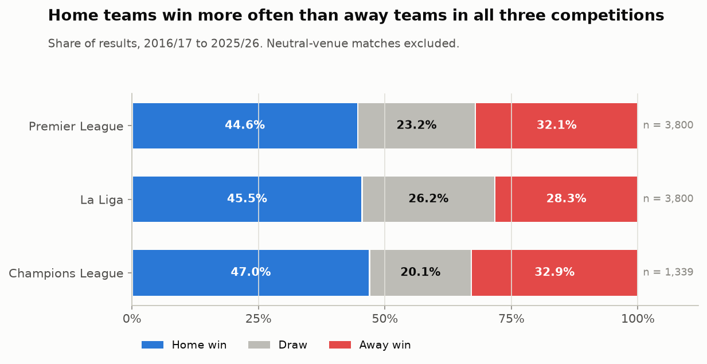
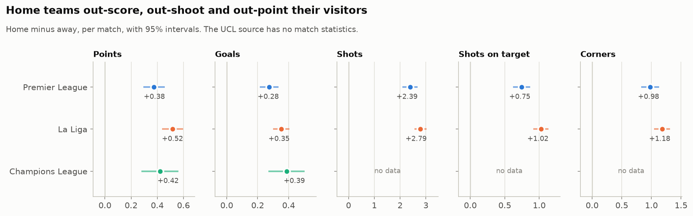
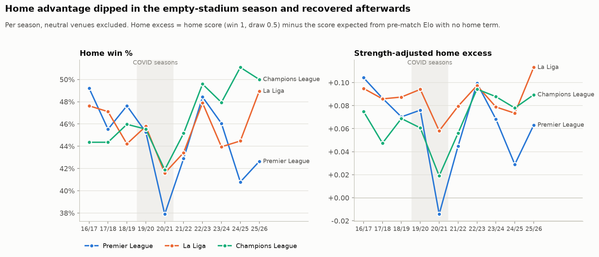
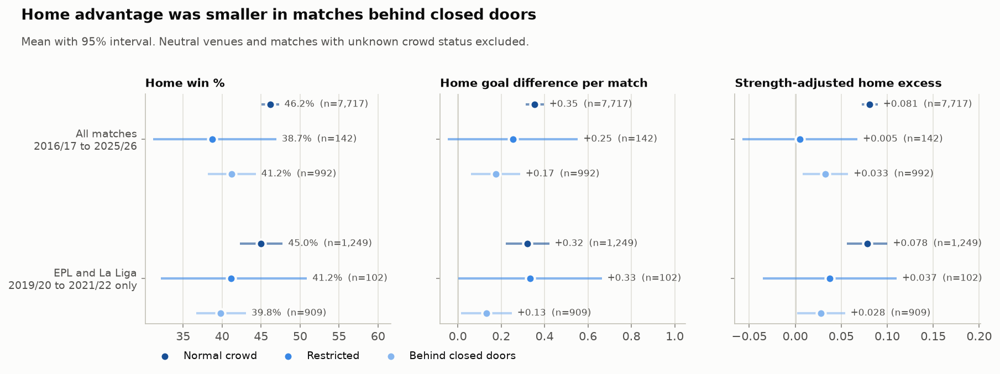
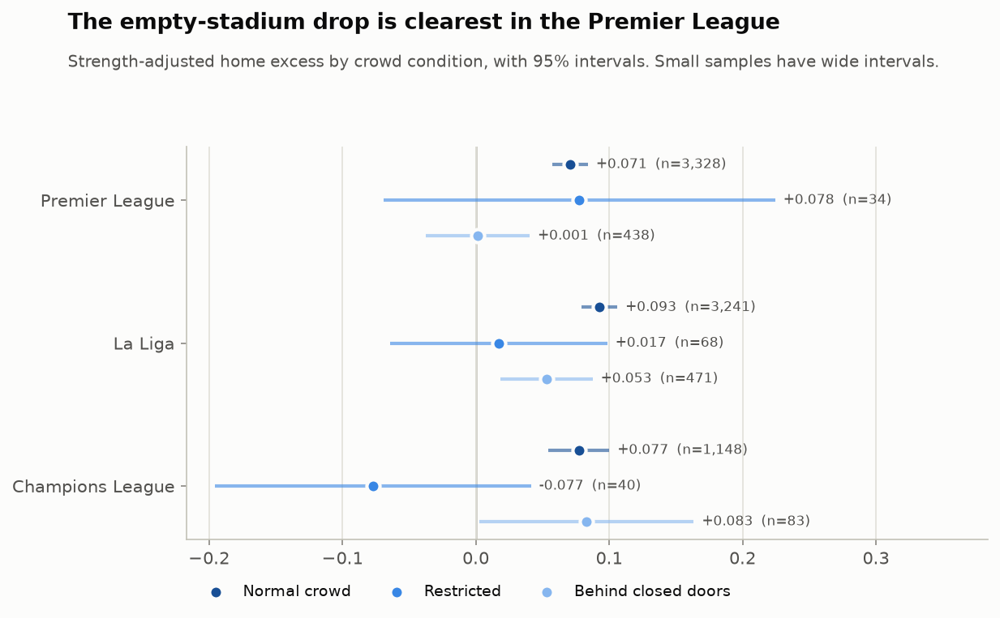
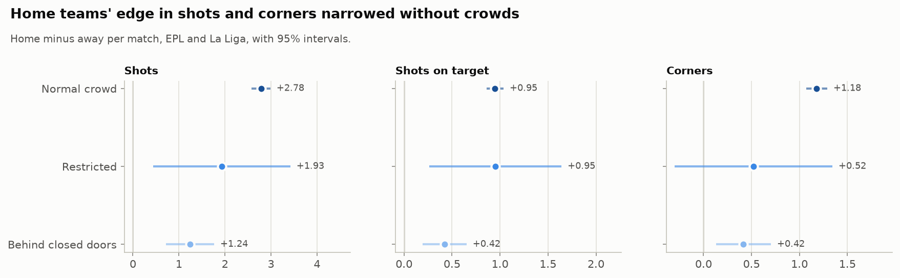
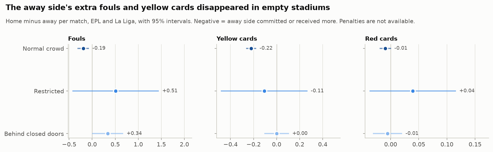
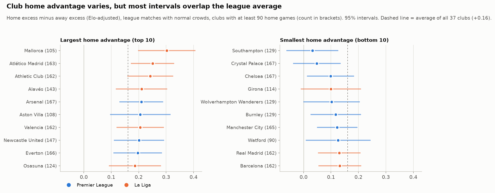
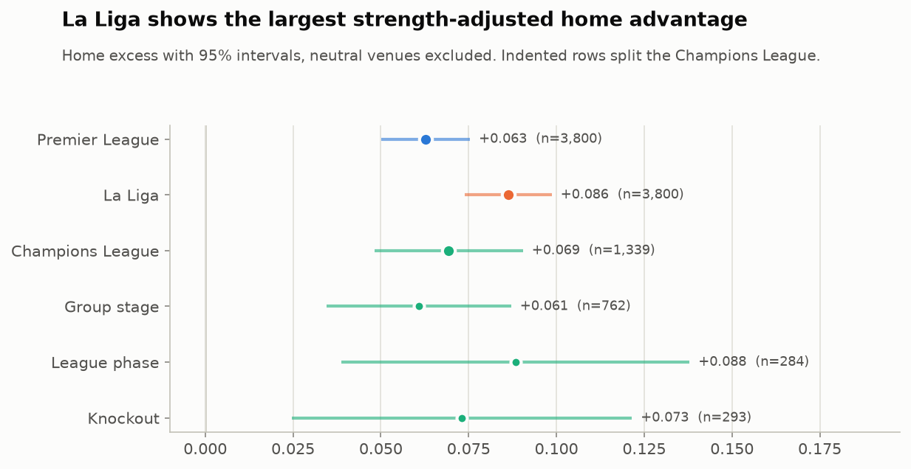
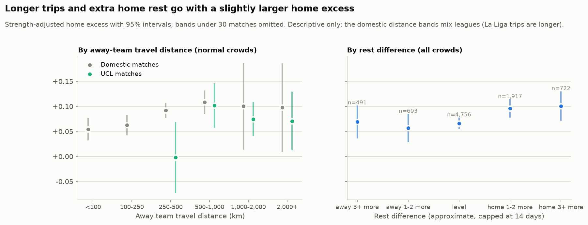

# Exploratory analysis (Phase 4)

This report covers research questions A to F from the project brief, plus a
first look at travel and rest. All figures and tables are regenerated by:

```bash
python -m src.features.build   # gold table, if not built yet
python -m src.analysis.eda     # reports/tables/eda_*.csv and reports/figures/eda_*.png
```

Everything here is **descriptive**. The 95% intervals show sampling
uncertainty for each number on its own. Formal tests, effect sizes and
regressions with controls come in Phase 5. Until then, a gap between two
groups is a pattern to test, not a finding.

## How home advantage is measured

Matches at neutral venues (finals, the Lisbon 2020 tournament and 2020/21
relocations; 33 matches) are excluded from every home-advantage figure. That
leaves 8,939 matches. Two measures are reported side by side
(`docs/methodology.md`):

- **Raw rates:** home win %, points, goals, goal difference, and for full
  league seasons the points share, `home points / (home + away points)`. A
  points share of 0.5 means no advantage.
- **Strength-adjusted home excess:** the home side's actual score (win 1,
  draw 0.5, loss 0) minus the score that pre-match Elo ratings predict with
  **no** home term.
  - Two equal teams are expected to score 0.5. An excess of +0.08 means
    home sides took 8 percentage points more of the available result than
    their strength alone predicts.
  - This measure stays fair when the opponents in a sample are unbalanced:
    the Champions League, crowd subsets and individual clubs.

## A. Does home advantage exist?



Yes, in all three competitions:

| | Premier League | La Liga | Champions League |
|---|---|---|---|
| Matches | 3,800 | 3,800 | 1,339 |
| Home win / draw / away win | 44.6% / 23.2% / 32.1% | 45.5% / 26.2% / 28.3% | 47.0% / 20.1% / 32.9% |
| Home vs away points per match | 1.57 vs 1.20 | 1.63 vs 1.11 | 1.61 vs 1.19 |
| Points share | 0.568 | 0.594 | n/a (unbalanced schedule) |
| Home excess (95% CI) | +0.063 (0.050 to 0.075) | +0.086 (0.074 to 0.099) | +0.069 (0.048 to 0.090) |



Home teams also out-perform their visitors on the underlying numbers:
- In EPL and La Liga they take 2.4 to 2.8 more shots, 0.7 to 1.0 more shots
  on target and about 1 more corner per match.
- In the Champions League they score 0.39 more goals per match.

Our Champions League source has no match statistics.

## B. Has home advantage changed over time?



Outside the COVID seasons there is **no steady decline** over the decade.
The season-to-season swings are about the size of the sampling noise
(the 95% interval for one league season is about ±0.04 in home excess). The clear break is
2020/21, the season played almost entirely without crowds:

| 2020/21 | Home win % | Home excess |
|---|---|---|
| Premier League | 37.9% | −0.014 (points share 0.487: away sides took more points) |
| La Liga | 41.6% | +0.058 (lowest of the decade) |
| Champions League | 41.9% | +0.019 (lowest of the decade) |

All three competitions returned to normal levels by 2022/23. The Premier
League's weak 2024/25 (+0.029 with full crowds) shows that a low season can
happen without empty stadiums.

## C. What happened when crowds disappeared?

The crowd conditions come from `crowd_status`, which is built from the
documented restriction rules, not from attendance counts (see
`docs/methodology.md`). The 88 matches with `unknown` crowd status are
excluded.



| All competitions | Matches | Home win % | Goal diff per match | Home excess (95% CI) |
|---|---|---|---|---|
| Normal crowd | 7,717 | 46.2% | +0.35 | +0.081 (0.072 to 0.090) |
| Restricted | 142 | 38.7% | +0.25 | +0.005 (−0.057 to 0.068) |
| Behind closed doors | 992 | 41.2% | +0.17 | +0.033 (0.008 to 0.057) |

Behind closed doors, the strength-adjusted home excess was about **60%
smaller** than with normal crowds, but it did not vanish. The same pattern
holds in a tighter comparison: domestic leagues only, 2019/20 to 2021/22,
which removes most of the decade-long and club-mix differences.
- Normal crowds: +0.078 (0.056 to 0.100)
- Behind closed doors: +0.028 (0.002 to 0.054)

Restricted-crowd matches are too few (142) to say anything yet.



| Home excess by competition | Normal crowd | Behind closed doors |
|---|---|---|
| Premier League | +0.071 (n=3,328) | +0.001 (n=438) |
| La Liga | +0.093 (n=3,241) | +0.053 (n=471) |
| Champions League | +0.077 (n=1,148) | +0.083 (n=83, interval 0.003 to 0.163) |

The drop is clearest in the Premier League, where home advantage
effectively disappeared without crowds. La Liga kept part of its home
advantage. The Champions League shows no drop, but with 83 matches the
interval is too wide to rule one out. Whether these differences between
competitions are real is the Phase 5 interaction model's job.



Underlying performance moved the same way (EPL and La Liga, home minus away
per match):

| | Normal crowd | Behind closed doors |
|---|---|---|
| Shots | +2.78 | +1.24 |
| Shots on target | +0.95 | +0.42 |
| Corners | +1.18 | +0.42 |

Home sides kept an edge on every measure, but it roughly halved.

## D. Did referee-related outcomes change?

These are **differences in referee-related outcomes**, not evidence of
referee bias. Fouls and cards also reflect how each team plays, and teams
may have played differently in empty stadiums. Penalties are not available
from any source we use.



| Home minus away per match (EPL and La Liga) | Normal crowd | Behind closed doors |
|---|---|---|
| Fouls | −0.19 (−0.32 to −0.07) | +0.34 (0.00 to 0.67) |
| Yellow cards | −0.22 (−0.27 to −0.18) | 0.00 (−0.11 to 0.11) |
| Red cards | −0.01 | −0.01 |

With crowds, away sides were called for more fouls and received more yellow
cards. Behind closed doors the yellow-card gap disappeared and the foul gap
reversed. Red cards are too rare to show a pattern. Phase 5 tests these
differences while controlling for team strength and match state.

## E. Which clubs have the strongest home advantage?

The club measure is the club's home excess minus its away excess, both
judged against Elo with no home term. It compares how much better a club
does at home than away after allowing for its opponents.
- Only league matches with normal crowds count.
- Only clubs with at least 90 home and 90 away matches (about five seasons)
  are included: 37 clubs.
- Raw points-per-match gaps are in `reports/tables/eda_e_teams.csv` for
  comparison.



- **Largest:** Mallorca (+0.30), Atlético Madrid (+0.25), Athletic Club
  (+0.24).
- **Smallest:** Southampton (+0.03), Crystal Palace (+0.05), Chelsea (+0.10).
- **Average:** +0.16 across all 37 clubs.

Most club intervals overlap the average. With 37 clubs, two or three would
sit outside it by chance alone, so this ranking needs the shrinkage or
multiple-comparison treatment planned for Phase 5 before any club is called
a "fortress".

## F. Which competition depends most on home advantage?



On the strength-adjusted measure, La Liga has the largest home advantage
(+0.086), ahead of the Champions League (+0.069) and the Premier League
(+0.063). The La Liga and Premier League intervals only just touch.

Within the Champions League, the group stage (+0.061), the league phase
(+0.088) and the knockouts (+0.073) overlap heavily. There is no visible
format effect yet.

## Supplementary: travel and rest



**Travel.** In domestic matches with normal crowds, home excess rises with
the away side's trip.
- Under 100 km: +0.054. Between 500 and 1,000 km: +0.108.
- Part of that is the league mix, because La Liga trips are longer. Within
  each league the gradient is smaller but still there:
  - Premier League: from +0.053 (shortest quarter of trips) to +0.088
    (longest quarter).
  - La Liga: from +0.070 to +0.105.
- The Champions League bands show no clear pattern.

**Rest.** When the home side had 3 or more extra days of rest, its excess
was +0.100, against +0.066 when rest was level. Rest days are approximate
because cup and Europa League matches are missing.

Both travel and rest go into the Phase 5 regressions alongside team
strength.

## What this sets up for Phase 5

- A test of normal-crowd versus behind-closed-doors home advantage
  (proportions, chi-square on H/D/A, effect sizes), and a strength-controlled
  regression with a crowd-status term.
- An interaction model asking whether the crowd effect differs by
  competition (the Premier League versus La Liga contrast above).
- Tests of the fouls and yellow-card differences, controlling for strength.
- Club-level estimates with shrinkage, so small samples don't top the
  ranking.
- Travel and rest effects estimated jointly with strength and competition.
