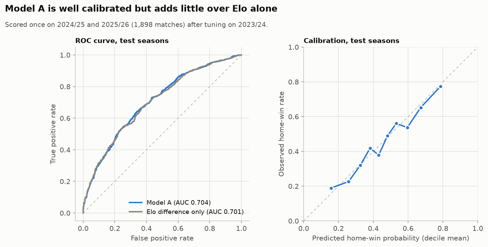
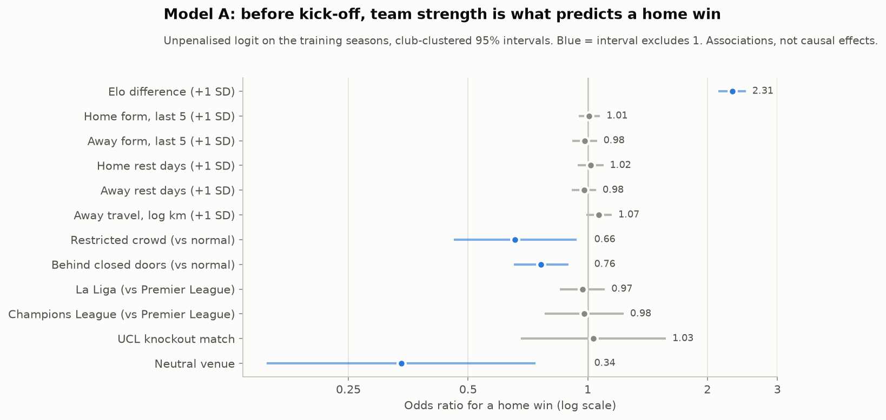
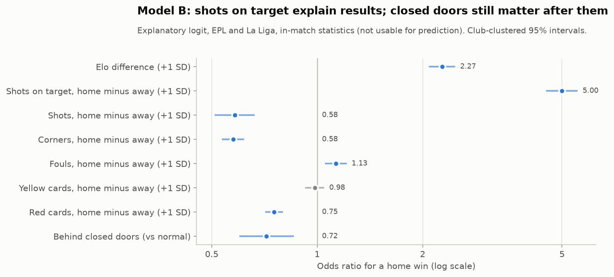
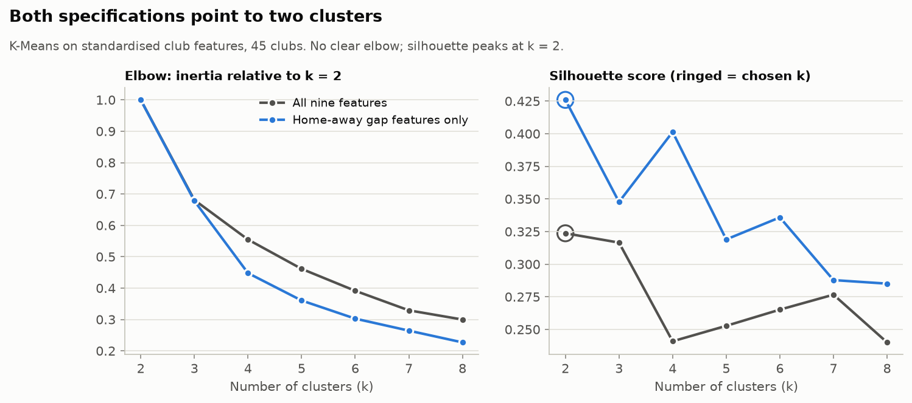
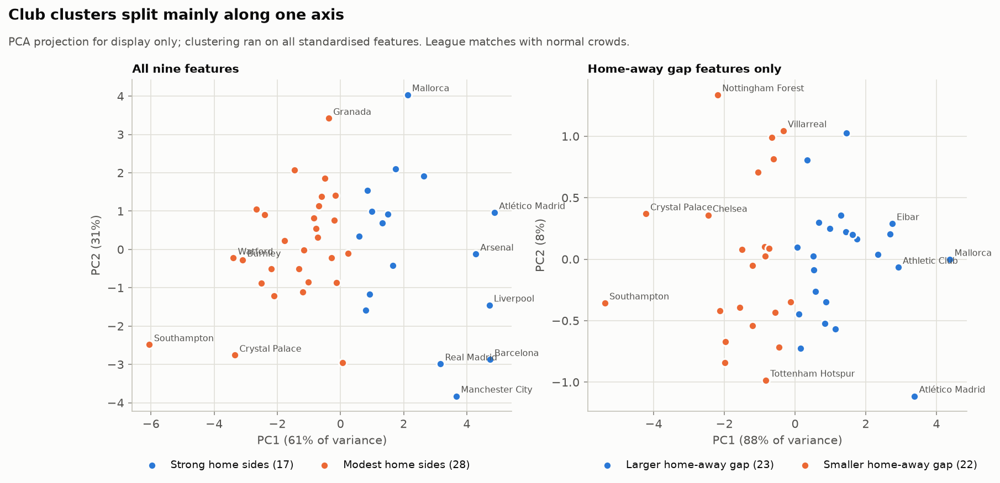

# Machine learning (Phase 6)

Phase 6 builds three models:

- **Model A** predicts a home win from information known before kick-off.
- **Model B** describes how in-match statistics relate to the result. It
  is explanatory only and is never used for prediction.
- **K-Means** groups clubs by their home record.

Everything below is regenerated by:

```bash
python -m src.models.logistic_model   # Model A and Model B -> reports/tables/ml_model_*.csv
python -m src.models.clustering       # K-Means -> reports/tables/ml_clusters_*.csv
```

As the brief asks, the goal is interpretation, not the highest possible
accuracy.

## Model A: pre-match home-win model

**Target.** `home_win` = 1 for a home win, 0 for a draw or away win. All
8,972 matches are included. Neutral venues are kept, with a flag.

**Features.** All are known before kick-off.

| Feature | Notes |
|---|---|
| Elo difference (home minus away) | Pre-match ratings only |
| Home form, away form | Points from each team's previous 5 matches |
| Home rest days, away rest days | Approximate: cup and Europa League matches are missing |
| Away travel distance | Log km |
| Crowd status | Reference: normal. Known before the match from the published restrictions |
| Competition | Reference: Premier League |
| UCL knockout match, neutral venue | Flags |

The brief also listed several predictors that are not used:
- **Attendance %:** not available.
- **Season:** a season label cannot generalise to future seasons; the crowd
  variables carry the COVID-period information instead.
- **In-match statistics:** these belong to Model B.

**Missing values.** Rest days are missing for each team's first match of a
season (3.5%), and form when a team has fewer than 5 prior matches (2%).
Each missing value is replaced by the training median, and a separate
indicator column records that it was missing. Nothing is filled silently.

**Time-based split.** No match is used before its season's turn.

| Set | Seasons | Matches | Used for |
|---|---|---|---|
| Train | 2016/17 to 2022/23 | 6,189 | Fitting |
| Validation | 2023/24 | 885 | Choosing the regularisation strength C, and a decision threshold |
| Test | 2024/25 to 2025/26 | 1,898 | One final evaluation, after refitting on train + validation |

**Tuning.**
- **C:** chosen by validation log loss from 0.001 to 10. The best was
  C = 0.1, but log loss is nearly flat between 0.03 and 10.
- **Decision threshold:** 0.5 is reported, plus 0.37, which maximised F1 on
  the validation season.

### Test results



| Model (test seasons) | Accuracy | Precision | Recall | F1 | ROC-AUC | Log loss | Brier |
|---|---|---|---|---|---|---|---|
| Model A, threshold 0.5 | 0.648 | 0.625 | 0.561 | 0.591 | **0.704** | 0.622 | 0.217 |
| Model A, threshold 0.37 | 0.613 | 0.551 | 0.813 | 0.657 | 0.704 | 0.622 | 0.217 |
| Elo difference only | 0.654 | 0.643 | 0.538 | 0.585 | 0.701 | 0.623 | 0.217 |
| Base rate (always "not a home win") | 0.545 | n/a | 0 | 0 | 0.500 | 0.689 | 0.248 |

**Confusion matrix** (threshold 0.5): 745 true negatives, 290 false
positives, 379 false negatives, 484 true positives.

**By competition (test):**

| Competition | ROC-AUC | Accuracy |
|---|---|---|
| Premier League | 0.69 | 0.64 |
| La Liga | 0.72 | 0.65 |
| Champions League | 0.70 | 0.64 |

**Reading the results.**
- The model beats the base rate clearly: ROC-AUC 0.70 against 0.50, and
  10 points of accuracy.
- It is **well calibrated**: across deciles, predicted probabilities track
  observed home-win rates.
- It adds **almost nothing over the Elo difference alone** (AUC 0.704
  against 0.701). Before kick-off, team strength carries nearly all the
  usable signal.
- On the validation season (2023/24) the AUC was 0.76, higher than on the
  test seasons. That is ordinary season-to-season variation in how
  predictable results are, not leakage: validation was scored by a model
  fitted on train only.
- The test seasons had no closed-doors matches, so the crowd variables
  could not help there. They matter for explanation (below), not for
  predicting normal seasons.

### Coefficients



To interpret the coefficients, the same features were fitted as an
unpenalised logistic regression on the training seasons only, with
standard errors clustered by home club
(`ml_model_inference_coefficients.csv`). Numeric predictors are
standardised, so odds ratios are per standard deviation.

| Predictor | Odds ratio (95% CI) | Direction |
|---|---|---|
| Elo difference, +1 SD | 2.31 (2.13 to 2.50) | Stronger home side ↑ home-win odds |
| Behind closed doors (vs normal) | 0.76 (0.65 to 0.89) | Empty stadium ↓ home-win odds |
| Restricted crowd (vs normal) | 0.66 (0.46 to 0.94) | Limited crowd ↓ home-win odds |
| Neutral venue | 0.34 (0.16 to 0.74) | Listed "home" side at a neutral venue ↓ odds |
| Away travel (log km), +1 SD | 1.07 (0.99 to 1.15) | Longer away trip ↑ odds, not significant (p = 0.09) |
| Home form, away form, rest days | 0.98 to 1.02, all p > 0.5 | No association once Elo is included |
| La Liga, Champions League, UCL knockout | 0.97 to 1.03, all p > 0.6 | No difference once strength is controlled |

**Multicollinearity is low.** The highest variance inflation factor among
the numeric predictors is 3.9, between the two rest-missing indicators,
which tend to occur together. Elo and form are 1.8 or less.

These are associations, not causal effects. The crowd odds ratios agree
with the Phase 5 regressions, which used a different sample definition.

## Model B: explanatory model with in-match statistics



**Purpose.** Model B asks how the result relates to what happened on the
pitch. It uses in-match statistics, so it can never be used for prediction
and is kept separate from Model A.

**Sample and setup.** 7,579 EPL and La Liga matches with known crowd status
and full statistics. The predictors are home-minus-away shots, shots on
target, corners, fouls, yellow cards and red cards (standardised), plus Elo
difference, crowd status and league. Standard errors are clustered by home
club.

| Specification | Closed-doors odds ratio | Pseudo R² |
|---|---|---|
| Without match statistics | 0.76 | 0.105 |
| With match statistics | 0.72 | 0.278 |

**What it shows.**
- **Shots on target dominate:** OR 5.0 per SD. Red cards hurt the side that
  receives them (OR 0.75 per SD of home-minus-away reds).
- **Conditional effects:** given shots on target, more total shots and more
  corners go with *lower* home-win odds (OR 0.58 each). These are not
  effects of shooting or corners themselves. A team that takes many shots
  but few on target, or wins many corners, is usually chasing a game it is
  losing.
- **Closed doors are not explained by match statistics.** Adding the
  statistics does not shrink the closed-doors effect; it slightly grows it.
  So the fall in home results behind closed doors was not only the smaller
  shot and corner edge seen in Phase 5. Even for the same shot balance,
  home sides converted it into fewer wins.
  - This is one plausible mechanism, not a proof. The data cannot say
    whether that came from finishing, goalkeeping or decisions not
    captured by these statistics.

## K-Means team segmentation

**Clubs.** One row per club and league: EPL and La Liga matches with normal
crowds, for clubs with at least 57 home and 57 away matches (three full
seasons). That gives 45 clubs. The Champions League is excluded because
clubs play too few, unbalanced home and away matches there.

**Features.** All nine features from the brief except attendance %, which
is not available:
- home win %, home points, goal difference, goals scored and goals conceded
  per game;
- home-versus-away differences in win %, points and goal difference;
- the strength-adjusted home-advantage index from Phase 4.

All features are standardised.

**Choosing k.** k from 2 to 8 was scored with:
- the elbow (inertia);
- the silhouette score;
- stability across 20 random starts (adjusted Rand index).

**Sensitivity check.** A second specification uses only the four
home-away gap features, so that overall club quality cannot drive the
split.



| Specification | Chosen k | Silhouette | Stability (ARI) | PC1 share |
|---|---|---|---|---|
| All nine features | 2 | 0.32 | 0.67 | 61% |
| Gap features only | 2 | 0.43 | 0.88 | 88% |

Neither specification has a clear elbow. The silhouette score peaks at
k = 2 in both. The nine-feature solution is only moderately stable: no k
reaches the 0.8 stability bar, so the highest silhouette was taken.



**Naming the clusters.** The names below were chosen after inspecting the
centroids (`ml_clusters_*_profile.csv`).

| Specification | Cluster | Clubs | Home points per game | Home-away points gap | Home-advantage index | Mean Elo |
|---|---|---|---|---|---|---|
| Nine features | **Strong home sides** | 17 | 1.97 | +0.58 | +0.19 | 1,577 |
| Nine features | **Modest home sides** | 28 | 1.40 | +0.44 | +0.15 | 1,424 |
| Gap only | **Larger home-away gap** | 23 | 1.70 | +0.60 | +0.20 | 1,487 |
| Gap only | **Smaller home-away gap** | 22 | 1.52 | +0.37 | +0.13 | 1,477 |

**Interpretation.**
- **Club quality drives the nine-feature split.** The "strong home sides"
  include the title contenders and are 150 Elo points stronger. They also
  have a somewhat larger home-away gap. The first principal component
  (61%) is essentially "good at home".
- **The gap-only split is independent of quality.** Mean Elo is almost
  identical in the two groups.
  - The larger-gap group (Mallorca, Atlético Madrid, Athletic Club,
    Granada, Arsenal and others) gains about +0.60 points per match at
    home.
  - The smaller-gap group (Southampton, Crystal Palace, Chelsea,
    Manchester City, Real Madrid and others) gains +0.37.
- **The two gap groups are halves of one continuum.** That axis explains
  88% of the variance.
- **The split is not significant.** Phase 5 found the club differences in
  home advantage are not statistically significant (Cochran's Q p = 0.14).
  Many clubs near the boundary could switch sides with a few results.

**Q11 (what distinguishes "fortress" clubs).** The clubs with the largest
home-away gaps are not simply the best teams. They come from both leagues
and from across the quality range. Over ten seasons, however, their
advantage is not reliably larger than average. The clusters describe the
data well, but they should not be presented as proven club types.

## Limitations

- **Pre-match prediction of football results is noisy by nature.** An AUC
  around 0.70 is typical, and bookmaker-level models do only modestly
  better.
- **Rest days are approximate,** and attendance is not available, so two
  of the brief's candidate predictors are weak or missing.
- **Model B uses in-match statistics** that are themselves affected by the
  score, so its coefficients are descriptive.
- **Club clustering uses 45 clubs.** Results depend on the minimum-match
  rule and on including the strength-adjusted index; both choices are
  documented in `src/models/clustering.py`.

## Next: Phase 7

Phase 7 builds the Streamlit and Plotly dashboard, the final figures, the
README findings and the presentation story.
