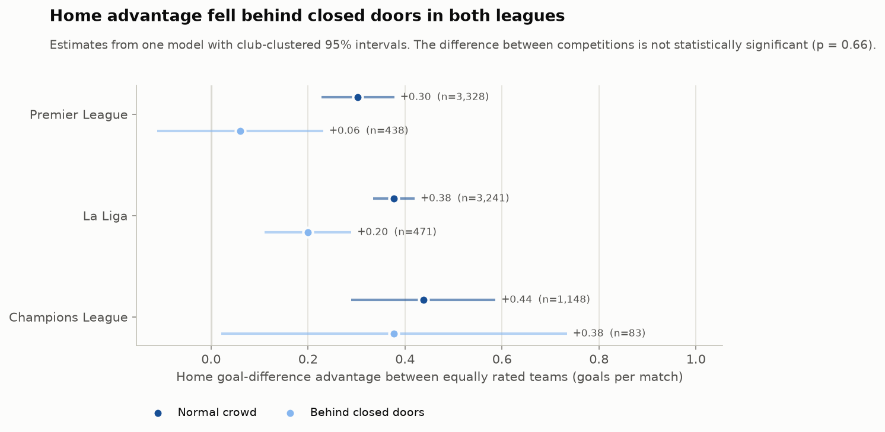
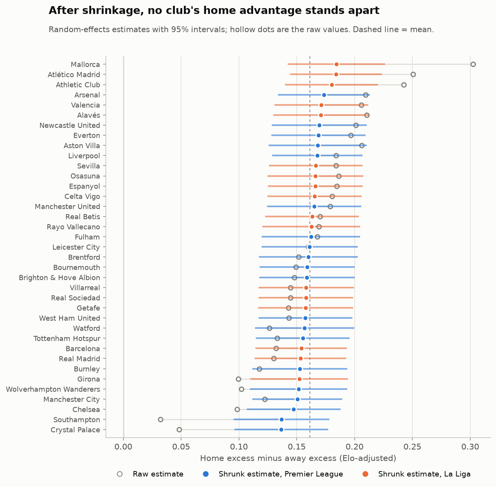
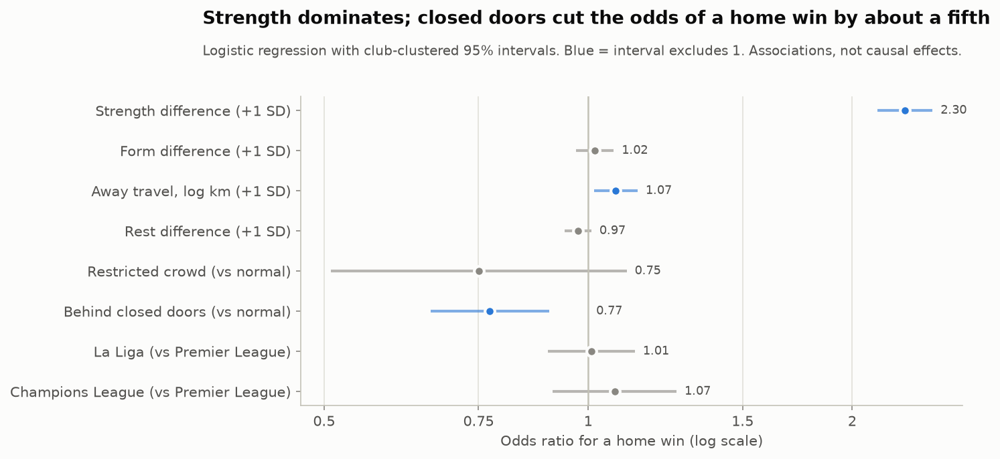

# Statistical analysis (Phase 5)

This report tests the patterns described in `reports/eda.md`. Every number
comes from the commands below:

```bash
python -m src.analysis.stats
```

Its outputs are:

- `reports/tables/stats_tests.csv`: one row per test, with the hypothesis,
  method, sample, statistic, p-value, Holm-adjusted p-value, estimate, 95%
  CI and effect size.
- `reports/tables/stats_coefficients.csv`: every model coefficient.
- `reports/tables/stats_interaction_effects.csv`,
  `stats_clubs_shrunk.csv` and `stats_vif.csv`.

## Approach

**Unit of analysis.** One match, seen from the home side. Neutral-venue
matches (33) are excluded. Crowd comparisons also drop the 88 matches whose
crowd status is `unknown`.

**Controlling for team strength.** Every model includes the pre-match Elo
difference, which uses only earlier results. A model's intercept or level is
therefore the home effect *between two equally rated teams*.

**Standard errors.** Clustered by home club, because one club's home matches
are not independent of each other. Test IDs below match `stats_tests.csv`.

**Multiple testing.** Fourteen tests were designated primary before looking
at these results:
- home excess in each competition (3 tests);
- the closed-doors home-win and goal-difference tests (2);
- the chi-square test on all matches (1);
- the competition interaction (1);
- shots on target, fouls and yellow cards (3);
- travel and rest in the factor model (2);
- the decade trend (1);
- club heterogeneity (1).

Holm's correction is applied across that family. All other tests are
supporting evidence and are reported unadjusted.

**Wording.** Results are associations. The empty-stadium period is a
natural experiment, but it also changed other things at the same time:
- fixture congestion, with the 2020 restart and a compressed 2020/21;
- five substitutions;
- no fans travelling either way.

So "behind closed doors" means the whole package of that period, not crowd
noise alone.

## Summary of answers

| # | Question | Answer from the tests |
|---|---|---|
| 1 | How large is home advantage? | Between equally rated teams with normal crowds, the home side is worth **+0.30 goals per match** (95% CI 0.23 to 0.37) in the Premier League, and more in La Liga and the Champions League. Significant in all three competitions (Holm p < 0.001). |
| 2 | Has it changed over the decade? | **No detectable trend** with normal crowds: −0.001 home excess per season (CI −0.004 to +0.002, Holm p = 0.76). |
| 3 | Did empty stadiums reduce it? | **Yes.** With strength and competition held equal, home goal-difference advantage was **0.20 goals per match lower** behind closed doors (CI −0.31 to −0.08, Holm p = 0.006). That is about two-thirds of the normal-crowd advantage. The odds of a home win were 22% lower (OR 0.78). The effect is **not robust** to season fixed effects (see below). |
| 4 | Did home performance change? | **Yes.** The home edge shrank by 1.6 shots, 0.5 shots on target and 0.8 corners per match (all p < 0.001). |
| 5 | Did referee-related outcomes change? | **Yellow cards, yes:** the away side's 0.22 extra yellows per match disappeared (Holm p = 0.015). The foul shift does not survive correction (Holm p = 0.16). There is no change in red cards. Penalties are not available. |
| 6 | Did the COVID effect differ by competition? | **No significant difference** (joint p = 0.66). The drop is significant within the Premier League (−0.24 goals) and La Liga (−0.18). The Champions League has only 83 closed-doors home matches, which is too few to say. |
| 7 | Which clubs get the largest home advantage? | **None stands apart.** Club differences are not statistically significant (Cochran's Q p = 0.14, I² = 21%). After shrinkage, every club's interval includes the mean. |
| 8 | Does away travel increase home advantage? | **Weak evidence, domestic only.** Odds ratio 1.07 per SD of log distance (p = 0.014), but this does not survive the multiple-testing correction (Holm p = 0.096). In domestic matches, doubling the away trip goes with +0.03 home goals (p = 0.001); there is no effect in the Champions League. |
| 9 | Does a rest advantage help? | **No evidence** once strength is controlled (OR 0.97 per SD, p = 0.14, Holm 0.54). Rebuilding rest with cup and Europa fixtures (2020/21 to 2024/25) gives the same answer (OR 0.98, p = 0.58). |
| 10 | Is attendance associated with home success? | **Not testable directly**, because no per-match attendance source is available. Crowd status is the proxy used in Q3. |
| 12 | Which factors matter most? | **Team strength dominates** (OR 2.30 per SD). Closed doors (OR 0.77) is the only other large factor. Travel is small, and form adds nothing beyond Elo. |

Question 11 (fortress profiles) belongs to the Phase 6 clustering.

## 1. Home advantage exists in every competition (Q1)

| Test | Estimate (95% CI) | Statistic | p (Holm) | Effect size |
|---|---|---|---|---|
| A2 Premier League: mean home excess = 0 | +0.063 (0.050 to 0.075) | t = 9.7 | < 0.001 | d = 0.16 |
| A2 La Liga | +0.086 (0.074 to 0.099) | t = 13.6 | < 0.001 | d = 0.22 |
| A2 Champions League | +0.069 (0.048 to 0.091) | t = 6.4 | < 0.001 | d = 0.18 |
| A1 Home share of decisive results (exact binomial vs 50%) | EPL 58.1%, La Liga 61.7%, UCL 58.8% | | all < 0.001 | Cohen's h 0.16 to 0.24 |

The effect sizes are small per match, as expected for a sport where single
results are noisy. Over a season they add up: at +0.30 goals per match, a
Premier League team gains about 6 goals of goal difference from its 19 home
matches compared with the same fixtures on neutral ground.

## 2. No trend across the decade (Q2)

The model is home excess regressed on a season counter and competition,
using normal-crowd matches only (M8).

- **Pooled:** the slope is −0.0013 per season (CI −0.0043 to +0.0016; Holm
  p = 0.76).
- **By competition:** EPL −0.004 (p = 0.07), La Liga 0.000, UCL +0.003. None
  is significant.

The 2020/21 dip is a crowd-period effect, not part of a decade-long decline.

## 3. Empty stadiums reduced home advantage (Q3)

**Unadjusted tests** compare normal crowds with closed doors.

| Test | Normal | Closed doors | Difference (95% CI) | p | Effect size |
|---|---|---|---|---|---|
| C1 Home-win rate, all | 46.2% | 41.2% | 4.9 pts (1.7 to 8.2) | 0.003 (Holm 0.026) | h = 0.10 |
| C1 EPL | 45.3% | 38.6% | 6.8 pts (1.9 to 11.6) | 0.008 | h = 0.14 |
| C1 La Liga | 46.3% | 41.0% | 5.4 pts (0.6 to 10.1) | 0.029 | h = 0.11 |
| C1 Champions League | 48.1% | 56.6% | −8.5 pts (−19.6 to 2.5) | 0.13 | h = −0.17 |
| C1 Domestic 2019/20 to 2021/22 only | 45.0% | 39.8% | 5.2 pts (1.0 to 9.4) | 0.017 | h = 0.10 |
| C3 Chi-square, H/D/A by 3 crowd levels | | | χ²(4) = 12.1 | 0.017 (Holm 0.099) | V = 0.03 |

The chi-square test loses significance after correction because it spreads
the signal over three crowd levels and three outcomes. The restricted-crowd
group adds little information, with only 142 matches.

**Strength-controlled models** (M1 to M3) control for the Elo difference
and competition, with club-clustered standard errors.

| Model | Closed-doors effect (95% CI) | p |
|---|---|---|
| M1 OLS, home goal difference | −0.197 goals (−0.310 to −0.084) | < 0.001 (Holm 0.006) |
| M2 Logit, home win | OR 0.78 (0.67 to 0.91) | 0.002 |
| M3 Ordered logit, A < D < H | cumulative OR 0.80 (0.70 to 0.91) | < 0.001 |
| M1 Restricted crowds | −0.158 goals (−0.411 to +0.096) | 0.22 |

In the OLS model, the normal-crowd home advantage between equal teams is
+0.30 goals per match in the Premier League. A drop of 0.20 goals removes
about two-thirds of it.

**Robustness (M1r).** Re-estimating within EPL and La Liga 2019/20 to
2021/22 **with season fixed effects** gives a similar point estimate,
−0.14 goals. The interval is much wider, though (−0.40 to +0.11, p = 0.27).
- With season fixed effects, the closed-doors effect is identified only by
  within-season contrasts, mainly 2019/20 before and after the shutdown.
- 2020/21 was almost entirely behind closed doors, so the model cannot
  separate it from "the 2020/21 season".
- The direction holds, but this design cannot rule out a season-level
  explanation. That caveat belongs in the final write-up.

## 4. Home teams' underlying performance changed (Q4)

The outcome is home minus away per match, for EPL and La Liga, controlling
for strength (M5).

| Statistic | Normal crowd, equal teams | Change behind closed doors (95% CI) | p |
|---|---|---|---|
| Shots | +2.57 | −1.56 (−2.31 to −0.80) | < 0.001 |
| Shots on target | +0.81 | −0.53 (−0.79 to −0.28) | < 0.001 (Holm < 0.001) |
| Corners | +1.07 | −0.77 (−1.16 to −0.38) | < 0.001 |

Without crowds, home teams created noticeably less relative to their
opponents. The reduced goal difference was therefore not just a change in
finishing or refereeing.

## 5. Referee-related outcomes (Q5)

These are **differences in referee-related outcomes**. Fouls and cards are
also shaped by how each team plays, and teams played differently without
crowds (Q4), so these results alone do not establish referee bias.

| Home minus away per match | Normal crowd, equal teams | Change behind closed doors (95% CI) | p | Holm p |
|---|---|---|---|---|
| Yellow cards | −0.22 | +0.22 (+0.08 to +0.36) | 0.002 | 0.015 |
| Fouls | −0.34 | +0.53 (+0.05 to +1.00) | 0.032 | 0.16 |
| Red cards | −0.01 | +0.00 (−0.02 to +0.03) | 0.78 | |

With crowds, away sides received about 0.22 more yellow cards per match
than home sides of equal strength. Behind closed doors that gap closed
completely, and the change survives the multiple-testing correction.

**Interpretation.** This pattern is consistent with crowd influence on
disciplinary decisions, as reported in earlier COVID-era studies. A rival
explanation also fits: away teams may have defended less when not facing a
hostile crowd. Separating the two would need per-incident data that the
sources do not provide.

## 6. Crowd effect by competition (Q6)



The interaction model (M4) is OLS of goal difference on strength,
competition, crowd status, and competition × crowd status, using matches
with normal crowds or behind closed doors.

| Competition | Normal crowd | Closed doors | Change (95% CI) | p |
|---|---|---|---|---|
| Premier League | +0.30 | +0.06 | −0.24 (−0.44 to −0.04) | 0.017 |
| La Liga | +0.38 | +0.20 | −0.18 (−0.29 to −0.07) | 0.001 |
| Champions League | +0.44 | +0.38 | −0.06 (−0.46 to +0.34) | 0.77 |

The joint test that all three changes are equal gives χ²(2) = 0.83,
p = 0.66 (Holm 0.76).

The Premier League lost a larger share of its advantage (about 80%) than La
Liga (about 45%), but the difference is not significant. The Champions
League estimate rests on 83 matches and cannot distinguish "no change" from
a drop as large as the leagues'.

**Defensible statement:** home advantage fell behind closed doors in both
domestic leagues, and the data cannot show that the size of the fall
differed between competitions.

## 7. Clubs (Q7)



**Method.** Club gaps (home excess minus away excess, from Phase 4) were
pooled in a random-effects model (DerSimonian-Laird). The sample is the 37
clubs with at least 90 home and 90 away league matches with normal crowds.

**Results.**
- **Heterogeneity:** Cochran's Q = 45.3 on 36 degrees of freedom, p = 0.14
  (Holm 0.54). I² = 21%, and the between-club standard deviation τ = 0.023.
- **Shrinkage:** each club is pulled toward the mean in proportion to its
  noise. Mallorca's raw +0.30 becomes +0.18, and Crystal Palace's +0.05
  becomes +0.14.
- **No club differs:** no club's shrunk 95% interval excludes the mean
  (+0.16).

The raw ranking in Phase 4 is mostly sampling noise. Clubs differ a little
in home advantage at most, and ten seasons are not enough to name genuine
"fortresses" with confidence.

## 8 to 12. Travel, rest and the main factors



**Model.** Logistic regression for a home win (M7) with standardised
numeric predictors, crowd status and competition. The sample is 8,253
matches where rest is known.

| Predictor | Odds ratio per 1 SD (95% CI) | p |
|---|---|---|
| Strength difference (1 SD = 186 Elo points) | 2.30 (2.14 to 2.47) | < 0.001 |
| Away travel, log km (1 SD = 1.22 log-km) | 1.07 (1.01 to 1.14) | 0.014 (Holm 0.096) |
| Rest difference (1 SD = 2.9 days) | 0.97 (0.94 to 1.01) | 0.14 (Holm 0.54) |
| Form difference, last 5 (1 SD = 4.8 points) | 1.02 (0.97 to 1.07) | 0.49 |
| Behind closed doors (vs normal) | 0.77 (0.66 to 0.90) | 0.001 |
| Restricted crowd (vs normal) | 0.75 (0.51 to 1.10) | 0.14 |
| La Liga / Champions League (vs Premier League) | 1.01 / 1.07 | 0.89 / 0.40 |

**Collinearity is low.** The highest variance inflation factor is 1.83
(strength and form), from `stats_vif.csv`. Form adds nothing once Elo is in
the model, which is expected, since Elo already summarises recent results.

**Travel within each scope** (M7b) is OLS of goal difference on log
distance, controlling for strength, with normal crowds only.
- **Domestic:** +0.050 goals per log-km (p = 0.001). A doubled away trip
  goes with about +0.03 home goals per match.
- **Champions League:** −0.015 (p = 0.84), so no detectable effect.
- **Caveats:** the pooled travel odds ratio does not survive the Holm
  correction, so travel is suggestive rather than established. Travel is
  also not randomly assigned. Distant domestic away trips
  are concentrated in La Liga (the Canary Islands and the far north-west),
  where other factors may also differ. The effect is small, and it does not
  survive in the Champions League, where distances are far larger.

**Rest** shows no association with home wins once strength is controlled.
In the matching goal-difference model, its coefficient is small and
*negative* (−0.05 goals per SD, p = 0.004), the opposite of the Phase 4
banded pattern. That instability points to confounding rather than a rest
effect. The likely cause is that the rest measure misses cup and Europa
League matches, so a club's "rest" partly reflects which competitions it
plays in.

**Re-check with complete fixtures (M7c).** For 2020/21 to 2024/25,
openfootball publishes every FA Cup, EFL Cup, Copa del Rey, Europa League
and Conference League fixture. Adding those dates shortens the rest of 16%
of league matches. The factor model was refitted on EPL and La Liga matches
from those seasons with each rest measure, on the same 3,652 matches:

| Rest measure | Odds ratio per 1 SD (95% CI) | p | Goal-difference coefficient per SD |
|---|---|---|---|
| League and UCL fixtures only | 0.98 (0.91 to 1.05) | 0.51 | −0.039 (p = 0.13) |
| All fixtures, including cups and Europa | 0.98 (0.90 to 1.06) | 0.58 | −0.015 (p = 0.59) |

With complete fixtures the odd negative goal-difference sign shrinks toward
zero, as expected if it came from the missing matches. Neither measure
shows a rest effect once strength is controlled.
- **Unadjusted,** home sides with more rest win *less* often (32% with 3+
  extra days against 45% when level). That is confounding: strong clubs play
  in Europe and the cups, so they rest less and also win more.
- These are supporting tests, outside the Holm family, because the primary
  rest test was fixed before this data was added.

The data do not support a rest advantage either way.

## Limitations

- **Crowd status comes from documented restriction rules,** not counted
  attendance. 88 matches are `unknown`, and some rules carry medium or low
  confidence. Attendance as a continuous variable (Q10) cannot be tested.
- **The closed-doors period also changed other things:** schedules,
  substitutions, travel conditions and team selection. The season-fixed-
  effects check shows the effect cannot be fully separated from the 2020/21
  season.
- **Complete rest days exist only for 2020/21 to 2024/25** and EPL and La
  Liga clubs. One-off matches (Community Shield, Supercopa, UEFA Super Cup,
  Club World Cup) and European qualifiers are still missing.
- **The Champions League has no match statistics** in our sources, so Q4
  and Q5 cover EPL and La Liga only, and its closed-doors sample is small.
- **Elo** is fitted with a home-advantage term of 60 points throughout,
  including the closed-doors period. That term only affects how ratings are
  updated after each match, not the home term the models estimate. The
  ratings stay unbiased measures of strength in both periods.
- **Club shrinkage** uses a normal approximation and treats the across-club
  mean as known when computing club intervals. That makes the intervals
  slightly narrow, which would only make "no club stands apart" more
  conservative.

## Next: Phase 6

- **Model A:** a pre-match logistic regression with a time-based split
  (train 2016/17 to 2022/23, validate 2023/24, test 2024/25 to 2025/26).
- **Model B:** an explanatory model using in-match statistics.
- **K-Means** team segmentation, with the number of clusters chosen by the
  elbow method and silhouette score.
